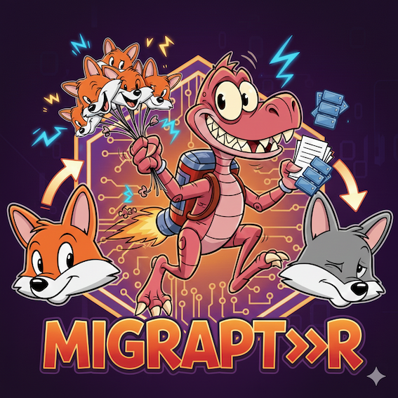

<p align="center">
  
</p>
<h1 align="center">MigRaptor</h1>
<p align="center">
  <strong>GitLab projects & groups migration tool</strong>
</p>
<p align="center">
  <a href="https://go.dev/"></a>
  <a href="LICENSE"></a>
</p>

A powerful CLI tool written in Go for managing GitLab projects and container registry images. This tool automates the complex process of transferring projects with container registry images between groups (which cannot be done through the GitLab UI) and provides utilities for cleaning container registry images.

## 🎯 Overview

MigRaptor provides two main capabilities:

### Migration
Transfer GitLab projects (including Docker container images) between groups. It handles:
- Group creation and transfer
- Project transfer
- Docker image backup and restoration
- Container registry management
- Project archiving/unarchiving

See [Usage](#migration-command)

### Clean
Clean up container registry images from GitLab projects with an interactive interface:
- Browse and select images across groups and sub-groups
- Preview deletion summary before confirming
- Support for tag filtering
- Dry-run mode for safe testing

See [Usage](#clean-command)

## 📋 Requirements

- **Go 1.25.6+** (for building from source)
- **Docker** (for pulling/pushing container images)
- **GitLab API Token** with appropriate permissions
- **Network access** to your GitLab instance and container registry

## 🚀 Installation

### Build from Source

```bash
# Clone the repository
git clone <repository-url>
cd migraptor

# Build the binary
go build -o migraptor ./cmd/migrate

# The binary will be created as 'migraptor' in the current directory
./migraptor [options]
```

### Install via Homebrew (macOS)

If you are on macOS you can install the prebuilt package via Homebrew Cask (provided by the project tap):

```bash
brew install --cask yodamad/tools/migraptor
```

This installs the `migraptor` binary system-wide (follow Homebrew output for the exact install path).

### Using Docker

The project provides a Docker image published on Docker Hub. Use that image instead of building locally if you prefer.

<details>
<summary>Click to expand Docker usage examples</summary>

**Migration with Docker:**
```bash
# Run with command-line options
docker run -i --rm yodamad/migraptor:0.5.0 -g <TOKEN> -o <OLD_GROUP> -n <NEW_GROUP>

# Run with config file (mount current directory)
docker run -i --rm -v $(pwd):/app yodamad/migraptor:0.5.0

# Run with verbose output
docker run -i --rm yodamad/migraptor:0.5.0 -g <TOKEN> -o <OLD_GROUP> -n <NEW_GROUP> -v

# Run with dry-run mode
docker run -i --rm yodamad/migraptor:0.5.0 -g <TOKEN> -o <OLD_GROUP> -n <NEW_GROUP> -f -v

# Persist logs: mount current directory so migrate.log is written to host
docker run -i --rm -v $(pwd):/app yodamad/migraptor:0.5.0 -g <TOKEN> -o <OLD_GROUP> -n <NEW_GROUP>
# then on host
cat migrate.log
```

**Clean command with Docker:**
```bash
# Run clean command
docker run -i --rm yodamad/migraptor:0.5.0 clean -g <TOKEN> -o <GROUP>

# Clean with dry-run
docker run -i --rm yodamad/migraptor:0.5.0 clean -g <TOKEN> -o <GROUP> -f -v
```

**Notes when using the Docker image**:
- The public image is `yodamad/migraptor:latest` on Docker Hub.
- The container runs as a non-root user for security; mount a host directory (e.g. `$(pwd)`) to persist logs and config.
- If you need to interact with your local Docker daemon (to pull/push images from registries), mount the Docker socket: `-v /var/run/docker.sock:/var/run/docker.sock` and ensure permissions are correct.
- Pass your GitLab API token securely (via flags or environment variables). Avoid embedding tokens in images.

</details>

## ⚙️ Configuration

The tool supports multiple configuration methods with the following priority (highest to lowest):

1. **Command-line flags** (highest priority)
2. **Environment variables**
3. **Config file** (YAML/TOML/JSON)
4. **Interactive prompts** (for missing mandatory values)

### Configuration File

Create a config file named `gitlab-migraptor.yaml` (or `.yml`, `.json`, `.toml`) in:
- Current directory (`./gitlab-migraptor.yaml`)
- Home directory (`~/.gitlab-migraptor.yaml`)

<details>
<summary>Click to expand configuration file example</summary>

Example `gitlab-migraptor.yaml`:
```yaml
gitlab_token: "your-gitlab-api-token"
gitlab_instance: "gitlab.com"
gitlab_registry: "registry.gitlab.com"
docker_token: "your-docker-token"  # Optional, defaults to gitlab_token
old_group_name: "source-group"
new_group_name: "destination-group"  # Required for migration, not needed for clean
projects_list: []  # Optional, empty means all projects
tags_list: []  # Optional, empty means all tags
keep_parent: true  # Keep parent group structure (migration only)
dry_run: false
verbose: false
```

</details>

### Environment Variables

<details>
<summary>Click to expand environment variables example</summary>

```bash
export GITLAB_TOKEN="your-token"
export GITLAB_INSTANCE="gitlab.com"
export GITLAB_REGISTRY="registry.gitlab.com"
export OLD_GROUP_NAME="source-group"
export NEW_GROUP_NAME="destination-group"  # Required for migration only
export PROJECTS_LIST="project1,project2"  # Optional
export TAGS_LIST="latest,stable"  # Optional
export KEEP_PARENT="true"  # Migration only
export DRY_RUN="false"
export VERBOSE="false"
```

</details>

## 📚 Usage

MigRaptor provides two main commands: `migrate` (default) and `clean`. Both commands share common configuration options.

### Common Command-Line Options

These options are available for both commands:

#### Mandatory Options
- `-g, --token`: Your GitLab API token
- `-o, --old-group`: The group containing the projects you want to work with

#### Optional Options
- `-f, --dry-run`: Perform a dry run without making actual changes
- `-i, --instance`: GitLab instance (default: `gitlab.com`)
- `-p, --docker-password`: Password for registry (defaults to GitLab token)
- `-r, --registry`: GitLab registry name (default: `registry.<gitlab_instance>`)
- `-t, --tags`: Comma-separated list of tags to filter (default: all tags)
- `-v, --verbose`: Enable verbose mode for debugging

### Migration Command

The default command (`migrate`) transfers GitLab projects and their container registry images between groups.

#### Basic Usage

```bash
migraptor -g <GITLAB_TOKEN> -o <OLD_GROUP_NAME> -n <NEW_GROUP_NAME>
```

#### Additional Options for Migration
- `-n, --new-group`: The full path of group that will contain the migrated projects (required for migration)
- `-k, --keep-parent`: Don't keep the parent group, transfer projects individually instead
- `-l, --projects`: Comma-separated list of projects to migrate (default: all projects)

#### Migration Examples

<details>
<summary>Click to expand migration examples</summary>

**Example 1: Simple Migration**
```bash
migraptor -g glpat-xxxxx -o old-group -n new-group
```

**Example 2: Migrate Specific Projects with Tag Filter**
```bash
migraptor \
  -g glpat-xxxxx \
  -o source-group \
  -n target-group \
  -l project1,project2 \
  -t latest,stable
```

**Example 3: Dry Run (Test Migration)**
```bash
migraptor \
  -g glpat-xxxxx \
  -o old-group \
  -n new-group \
  -f \
  -v
```

**Example 4: Transfer Projects Individually (Don't Keep Parent)**
```bash
migraptor \
  -g glpat-xxxxx \
  -o old-group \
  -n new-group \
  -k
```

</details>

### Clean Command

The `clean` command (aliased as `cl`) provides an interactive interface to browse and delete container registry images from GitLab projects.

#### Basic Usage

```bash
migraptor clean -g <GITLAB_TOKEN> -o <GROUP_NAME>
```

or using the alias:

```bash
migraptor cl -g <GITLAB_TOKEN> -o <GROUP_NAME>
```

#### Features

- **Interactive Image Selector**: Browse and select images across all projects in a group (including sub-groups)
- **Summary View**: Preview selected images before deletion
- **Tag Filtering**: Use `-t` flag to filter images by tags
- **Dry-Run Support**: Test deletions safely with `-f` flag
- **Project Filtering**: Use `-l` flag to limit to specific projects

#### Clean Examples

<details>
<summary>Click to expand clean command examples</summary>

**Example 1: Interactive Clean (All Images)**
```bash
migraptor clean -g glpat-xxxxx -o my-group
```

**Example 2: Clean with Tag Filter**
```bash
migraptor clean -g glpat-xxxxx -o my-group -t old-tag,deprecated
```

**Example 3: Dry Run (Preview Deletions)**
```bash
migraptor clean -g glpat-xxxxx -o my-group -f -v
```

**Example 4: Clean Specific Projects**
```bash
migraptor clean -g glpat-xxxxx -o my-group -l project1,project2
```

</details>

## 🔧 How It Works

<details>
<summary>Click to expand architecture and implementation details</summary>

### Architecture

The tool is organized into several packages:

```
migraptor/
├── cmd/migrate/          # Main CLI entry point
│   └── main.go
├── internal/
│   ├── config/          # Configuration management
│   │   └── config.go
│   ├── gitlab/          # GitLab API client wrapper
│   │   └── client.go
│   ├── docker/          # Docker API client wrapper
│   │   └── client.go
│   ├── migration/       # Migration logic
│   │   ├── groups.go    # Group operations
│   │   ├── projects.go  # Project operations
│   │   └── images.go    # Image operations
│   ├── command/         # Command implementations
│   │   └── clean.go     # Clean command logic
│   └── ui/              # User interface and logging
│       ├── output.go
│       ├── image_selector.go
│       └── image_summary.go
└── go.mod
```

### Migration Flow

1. **Initialization**
   - Load configuration from multiple sources (flags, env, config file, prompts)
   - Initialize GitLab and Docker clients
   - Verify connections and permissions

2. **Group Discovery**
   - Search for source group by name/path
   - Build destination group path
   - Create destination group structure (nested groups if needed)

3. **Backup Phase** (for each project)
   - Unarchive archived projects if needed
   - List container registry repositories
   - Pull all images matching tag filters
   - Delete registry repositories (after backup)

4. **Transfer Phase**
   - **If `keep_parent=true`**: Transfer entire group to destination
   - **If `keep_parent=false`**: Transfer each project individually

5. **Restore Phase** (for each project)
   - Tag images with new registry paths
   - Push images to new registry location
   - Re-archive projects if they were archived

### Clean Flow

1. **Initialization**
   - Load configuration (same as migration)
   - Initialize GitLab client
   - Verify connections and permissions

2. **Group Discovery**
   - Search for source group by name/path
   - Discover all projects including sub-groups

3. **Image Collection**
   - Collect all images from all projects in the group
   - Apply tag filters if specified
   - Build image list with metadata

4. **Interactive Selection**
   - Display interactive image selector UI
   - Allow user to browse and select images
   - Show summary of selected images

5. **Deletion**
   - Confirm deletion with user
   - Delete selected images from registry
   - Report success/failure for each deletion

### Key Components

#### Configuration (`internal/config`)
- Multi-source configuration loading (flags > env > file > prompts)
- Validation of required fields
- Default value handling

#### GitLab Client (`internal/gitlab`)
- Wraps the official GitLab Go SDK (`gitlab.com/gitlab-org/api/client-go`)
- Provides simplified API for:
  - Group search, creation, transfer
  - Project listing, transfer, archive/unarchive
  - Container registry management

#### Docker Client (`internal/docker`)
- Wraps the Docker Go SDK (`github.com/docker/docker`)
- Handles:
  - Docker daemon status checking
  - Image pull/push operations
  - Image tagging
  - Registry authentication

#### Migration Logic (`internal/migration`)
- **Groups**: Group path building, nested group creation
- **Projects**: Project filtering, archiving, transfer
- **Images**: Image backup, tag filtering, restoration

#### UI (`internal/ui`)
- Colored terminal output (matching original bash script style)
- Structured logging to `migrate.log`
- Debug/verbose mode support
- Interactive image selector (Bubble Tea TUI)
- Image summary display

</details>

## 🧪 Testing

### Dry Run

Always test with `-f` (dry-run) flag first:

```bash
migraptor -g <TOKEN> -o <OLD_GROUP> -n <NEW_GROUP> -f -v
```

This will show you what would happen without making actual changes.

### Verbose Mode

Use `-v` flag for detailed debugging information:

```bash
./migraptor -g <TOKEN> -o <OLD_GROUP> -n <NEW_GROUP> -v
```

All operations are logged to `migrate.log` in the current directory.

## 📝 Logging

The tool creates a `migrate.log` file in the current directory with:
- Timestamped entries
- Operation details
- Error messages
- Debug information (when verbose mode is enabled)

## 🚸 Known Limitations

- **Same GitLab Instance Only**: Currently only supports transferring within the same GitLab instance
- **Docker Required**: Docker daemon must be running and accessible
- **Registry Access**: Requires proper authentication to both source and destination registries
- **Group Transfer**: Group transfer may fail if the group contains nested groups or other complex structures

## 🔒 Security Considerations

- **API Tokens**: Store tokens securely, use environment variables or config files with proper permissions
- **Docker Credentials**: Docker login credentials are handled securely through Docker's credential store
- **Log Files**: Log files may contain sensitive information - review and secure appropriately

## 🛠️ Development

### Project Structure

- **Go 1.25.6**: Minimum required Go version
- **Cobra**: CLI framework (`github.com/spf13/cobra`)
- **Viper**: Configuration management (`github.com/spf13/viper`)
- **GitLab SDK**: Official GitLab Go client (`gitlab.com/gitlab-org/api/client-go`)
- **Docker SDK**: Official Docker Go client (`github.com/docker/docker`)

### Building

```bash
# Build
go build -o migraptor ./cmd/migrate

# Run tests (if any)
go test ./...

# Format code
go fmt ./...

# Run linter
golangci-lint run
```

## 📄 License

See [LICENSE](LICENSE) file for details.

## 🤝 Contributing

Contributions are welcome! Please ensure:
- Code follows Go best practices
- Tests are included for new features
- Documentation is updated
- Build passes without errors

## 📞 Support

For issues, questions, or contributions, please open an issue or pull request in the repository.
